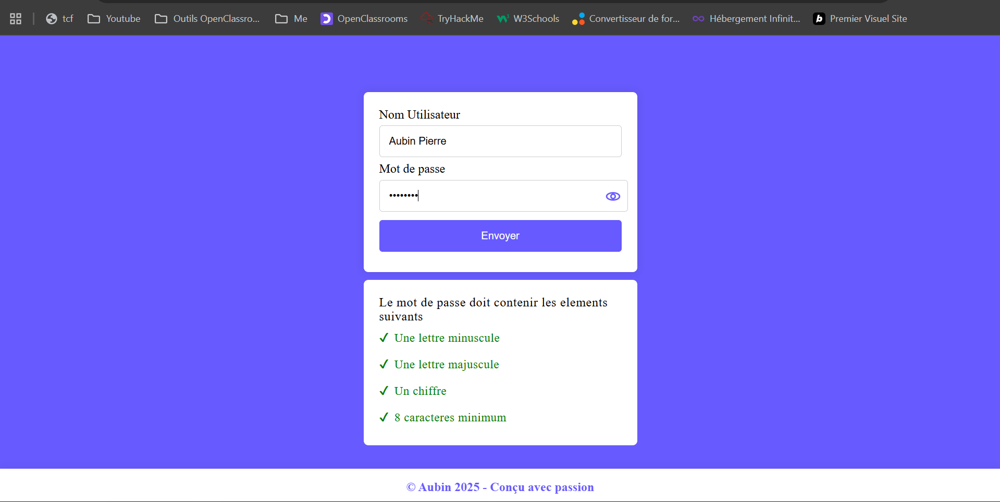
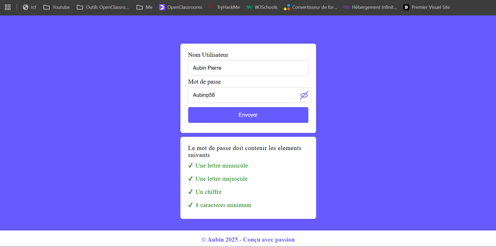

# Verifier-un-mot-de-passe

Un projet simple en *HTML, CSS et JavaScript* qui permet de créer un formulaire de connexion avec une validation de mot de passe.

## Fonctionnalités
- Champ *Nom d'utilisateur*
- Champ *Mot de passe* avec affichage/masquage
- Vérification du mot de passe en temps réel selon 4 règles :
  1. Au moins *une lettre minuscule*
  2. Au moins *une lettre majuscule*
  3. Au moins *un chiffre*
  4. Minimum *8 caractères*

## Technologies utilisées
- HTML5
- CSS3
- JavaScript

  ##  Captures d'écran  

|  |  |
